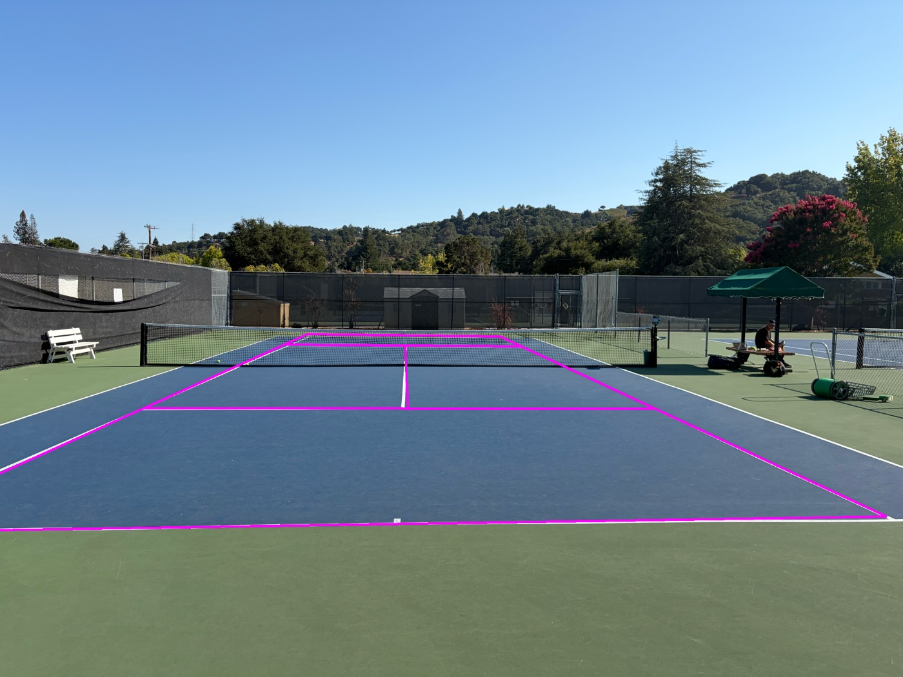

# LiveCoach — real-time tennis coaching, entirely on an iPhone

Mount a phone on the fence, press start, and it coaches you: it finds the court
by itself, tracks both players and the ball on the Neural Engine, detects the
frame you strike the ball, and buzzes a Bluetooth device when your opponent is
out of position. No calibration, no taps, no server.



*The court model fitted automatically to a photo of a real court — no tapping, no
training data. Support 0.94, six model lines matched, ~1 second.*

### What's technically interesting here

**A classical computer-vision algorithm ported to Swift with no OpenCV.**
`CourtDetect.swift` implements the whole court-fitting pipeline by hand — line
mask, Hough transform, vanishing-point grouping, an exhaustive ~200k-hypothesis
model fit, and ICP refinement against line pixels — using only Accelerate and a
LAPACK homography solve. It scores **2.28px median keypoint error on 200
ground-truth frames**, between a published deep network's base (2.83px) and
refined (1.83px) results, with nothing to train and no weights to ship.

**Validated against the reference implementation, not just eyeballed.** The Swift
detector is cross-checked against the Python on identical pixel buffers; where the
two disagree, the measured line residual decides which is right. Two porting bugs
were caught this way that reading the code would not have found: a Swift `Range`
that traps where numpy clips, and a brush shape that inflated a *ranking* metric
enough to change which hypothesis won.

**Concurrency where it counts.** Detection costs seconds, so the court map is
acquired and maintained on a background queue and handed to the capture thread
through an explicit queue — the video loop never blocks, and no homography is read
on one thread while written on another.

**Honest about its limits.** Accuracy in the far half is set by camera height, not
by the algorithm: mounted at eye level the far half spans ~70px, so one pixel of
line error is ~0.18m against a 2m alert threshold. That was measured, not assumed.

Ported from the Python reference implementation at
[tennis-beeper](https://github.com/drewgoldman117/tennis-beeper), whose `CLAUDE.md`
documents why each threshold and gate exists.

## What's already done for you

- **`Models/PlayerDetector.mlpackage`** — YOLOv8n (COCO), Core ML, **fixed 640×640**, NMS baked in.
- **`Models/BallDetector.mlpackage`** — RJTPP tennis-ball detector, Core ML, **fixed 1280×1280**, NMS baked in.
  - Both are exported at a **fixed input shape** — the make-or-break Neural Engine
    lesson: a dynamic-shape model silently falls back to CPU (≈5× slower).
  - Confidence/IoU thresholds are baked into each model's NMS layer: **player
    conf 0.25, ball conf 0.12** (the ball is tiny, so its confidences run low),
    both at **iou 0.45**. `convert_coreml.py` now passes these explicitly —
    Ultralytics' defaults have drifted (8.4.92 defaults iou to 0.7), and a
    re-export that relies on them silently produces a worse ball model.
- **`Sources/*.swift`** — the whole app (see Architecture below). The homography
  solver was verified against the Python/OpenCV implementation during development
  (exact recovery + noise robustness), and every source file has been typechecked
  against the iOS 17 SDK. Note there is **no test target in this repo** — that
  verification isn't reproducible from a checkout, so re-verify by hand if you
  touch `Homography.swift`.
- **`Assets.xcassets`** — the app icon (rendered by `Tools/make_appicon.py`) and
  the launch-screen colour. See **Design** below.
- **`LiveCoach.xcodeproj`** — the Xcode project is **already generated** (via
  XcodeGen from `project.yml`), with the models and asset catalog added, the
  camera-permission key set, landscape-only, iOS 17 deployment. You do **not**
  build the project by hand — just open it.

## Prerequisites

1. **Xcode 16.4** (installed at `/Applications/Xcode-16.4.0.app` — the last Xcode
   that runs on macOS 15 Sequoia).
2. **A free Apple ID** — enough to deploy to your own iPhone (7-day provisioning;
   re-run from Xcode weekly to re-sign).
3. **An iPhone 14–17 Pro** (iOS 17+), on the same Mac via USB.

## Open and run (~5 min)

### 1. Open the project
```
open /Users/drewgoldman/Documents/LiveCoachApp/LiveCoach.xcodeproj
```
(Everything — sources, models, Info.plist, orientation — is already wired up.)

### 2. Set your signing team (one time)
- Select the **LiveCoach** target ▸ **Signing & Capabilities**.
- **✔ Automatically manage signing** → **Team:** pick your Apple ID (or
  *Add an Account…* and sign in with your free Apple ID).
- If it complains the bundle id is taken, change **Bundle Identifier** to
  something unique like `com.<yourname>.livecoach`.

### 3. Connect your iPhone and run
- Plug in the phone, pick it in the run-destination menu (top bar), press **▶**.
- **First time:** Xcode will offer to **download the iOS platform / device
  support** — accept it (one-time ~7 GB). This is the "iOS 18.x not installed"
  component; it isn't bundled with Xcode.
- **First run on a free account:** on the phone, **Settings ▸ General ▸ VPN &
  Device Management ▸ trust your developer certificate**, then launch again.
- Grant camera permission when prompted.

> Changed `project.yml` or added/moved a Swift file? Regenerate with
> `xcodegen generate` from this folder (XcodeGen is installed via Homebrew).

## Using it

1. **Home.** Launch lands here. It reports what the app actually knows — whether
   a court map is saved and how old it is, whether the Core ML models are in the
   bundle, and your last session. **START SESSION** is always the primary action.
2. **The court finds itself — there is nothing to tap.** On starting a session,
   `LiveCourt` medians a few seconds of the camera (players vanish, the court
   stays), runs `CourtDetect` on it, and adopts the fit. It keeps going after
   that: it retries until it acquires — the camera may open on a close-up, on
   someone crossing frame, or on its own auto-exposure settling, and on the
   prototype's clips 2 of 8 needed exactly this (they acquired at 18s and 30s) —
   and it re-checks periodically, re-detecting only when the current fit has
   stopped matching the paint, which is what catches the phone being knocked.
   The result is saved to `calibration.json`, so later sessions start with a map
   in hand and merely verify it. The HUD shows **FINDING COURT…** until there is
   one.

   *Why this rather than tapping:* the phone ends up zip-tied to a fence out of
   arm's reach. Anything needing its screen touched is unusable there, and a
   hand calibration can never notice the camera moved.
3. **Calibrate by hand (fallback only).** If the detector can't fit your court,
   **SET COURT BY HAND** on home — or **Recalibrate** inside a session — opens
   the tap screen: **tap the 8 landmarks in the on-screen order** (far baseline
   L/R, far service line L/R, net L/R, near baseline L/R). If the mount can't
   see your own baseline, tap just the first **6** and Save. *Undo / Reset* to
   fix mistakes, *Cancel* to back out.
3. **Live view.** You'll see green player boxes, red foot dots with each player's
   `(x, y)` court position in meters, a yellow ball marker, the yellow court
   outline reprojected onto the image, a minimap, and an `fps · ms · players`
   HUD. **Recalibrate** (top-right) any time the phone moves; **End** returns
   home and records the session (`last_session.json`).

## Architecture (maps 1:1 to the Python prototype)

| Swift | Python | Role |
|-------|--------|------|
| `Court.swift` | `src/court.py` | Court geometry + coordinate convention (constants) |
| `Homography.swift` | `cv2.findHomography` / `perspectiveTransform` | Normalized DLT solve (LAPACK) + apply/invert |
| `Calibration.swift` | `src/calibrate.py` output | Fit from points, save/load JSON |
| `CourtDetect.swift` | `src/court_detect.py` | **Automatic court detection**: line mask → Hough → vanishing-point grouping → hypothesis search → support × completeness → ICP. No OpenCV; all hand-written |
| `LiveCourt.swift` | `live.py`'s `LiveCourt` | Background acquisition + drift re-check, off the capture thread. Accuracy/speed measured — see "Court detection, measured" |
| `CalibrationView.swift` | `src/calibrate.py` UI | Tap-the-court screen — the FALLBACK, not the main path |
| `CameraManager.swift` | `src/video_source.py` + capture | AVCaptureSession, landscape, 60fps |
| `Detectors.swift` | `src/detect.py` + `src/ball_tracker.py` | Both Core ML models via Vision; player IoU tracker + 5-frame court smoothing; ball trajectory-consistent selection + court bounds |
| `LiveView.swift` | `src/live.py` | Live pipeline + overlay + minimap + HUD + session chrome |
| `Geometry.swift` | — | Shared aspect-fit frame↔view transform |
| `ContentView.swift` | — | Routing: home ⇄ calibrate ⇄ live |
| `HomeView.swift` | — | Home screen + the drawn court/bisector diagram |
| `DesignSystem.swift` | — | Colour, type, metrics, shared controls (see Design) |
| `SessionLog.swift` | — | One-record session history the home screen reports |
| `Contact.swift` | `src/contact.py` | Contact detection + the causal `LiveContactDetector` |
| `Tactics.swift` | `shot_cone` / `find_opponent` / `bisector_offset` in `src/detect.py` | Shot cone, opponent, offset off the bisector |
| `BuzzerLink.swift` | `src/buzzer.py` | Held CoreBluetooth link to the Shelly BLU buzzer |
| `BuzzerPairingView.swift` | — | One-time pairing sheet |

## Court detection, measured

Scored against the public [TennisCourtDetector dataset](https://huggingface.co/datasets/Gholamreza/tennis_court_keypoints_dataset)
— 8841 broadcast frames (hard/clay/grass) with 14 hand-checked court keypoints each —
using the same metric that project's paper reports. On 200 random validation frames:

| | this detector | that paper's deep network |
|---|---|---|
| detected | **100%** | — |
| median keypoint error | **2.28px** | 2.83px base, 1.83px refined |
| within 7px | **97.5%** | their headline metric |

So the classical approach here sits between their base and refined models, with no
network, no training data and no GPU. On-device cost, quiet machine: 0.66s for a 720p
frame, 2.84s for 3K — it runs on a background queue (`LiveCourt`), never the capture
thread.

`CourtDetect.swift` is cross-validated against the Python on identical pixels
(`scratchpad/crossval.py` dumps the same grayscale frame into both): 5/5 clips detected by
both, three agreeing to 0.01–0.14m, and on the two that diverge the SWIFT fit is the better
one against the hand calibration (0.14m vs 6.11m, 0.32m vs 1.71m).

**When benchmarking this, check `uptime` first and interleave the variants.** A "3.4x
speedup" measured here turned out to be macOS indexing a freshly-extracted image set at
load average 68–105; the same load made a separate Swift run look like a regression. The
real figure, measured interleaved on a quiet machine, is ~1.5x.

## Verifying the ported logic

There is no test target, but the contact/tactics port is checkable against the
Python reference on identical inputs, which is how it was validated:

```bash
# in the Python repo: cache one clip's detections
python src/detect.py videos/<clip> --track-ball --flash-contacts \
    --detections-cache output/caches/<clip>_dets.json

# here: run the APP's code over that same cache
xcrun swiftc -O Tools/verify_contacts.swift \
    Sources/Contact.swift Sources/Tactics.swift Sources/Court.swift Sources/Homography.swift \
    -o /tmp/verify
/tmp/verify ../tennis-beeper/output/caches/<clip>_dets.json \
            ../tennis-beeper/calibration/auto_<clip>.json 30
```

Result on `screenrec_clean` (2026-08-06): **identical to Python** — same three
contacts (frames 18/182/344), same scores (58.2/40.5/36.8), same opponent
offsets (0.1m/0.1m/2.8m), from both the offline and the causal detector. Re-run
this after touching any threshold in `Contact.swift`; a port that merely compiles
proves nothing.

## Design

The direction is a **broadcast / instrument HUD**: near-black surfaces, hairline
rules, monospaced numerals, and a single yellow-green accent. It's the honest
expression of what this is — a measuring instrument — and it's the same
vocabulary as the live overlay, so home and camera read as one app rather than
two. Every token lives in `DesignSystem.swift`; don't hardcode a colour, font or
radius anywhere else.

Four rules hold it together:

- **One accent.** `DS.Color.accent` marks the primary action, the bisector, and
  live state. Nothing else. If everything is highlighted, nothing is.
- **Monospace means machine state.** Numbers, labels and readouts are
  monospaced; prose is not. It's how you tell measurement from writing.
- **Structure from hairlines and space,** never from heavy borders or fills.
- **Never show a number the app didn't measure.** The status panel reports the
  saved court map, whether the models are really in the bundle, and the real last
  session; the buzzer says *"not in this build"* because BLE isn't ported.
  One decorative statistic would undermine every real one beside it.

**Vertical space is the scarce resource.** The app is landscape-only (the phone
lives on a fence), so the home screen has ~400pt of height on a Pro and ~320pt
on an SE. Two roomy panels overflowed and clipped the buttons off-screen; the
status column is now one panel inside a `ScrollView`, so on a small phone the
readout scrolls rather than the action disappearing. Check both the calibrated
and uncalibrated states after any layout change — the calibrated one is taller.

**App icon** — the court in perspective with the glowing bisector beam, i.e. the
signal the product actually computes. Drawn in code so it can be re-rendered at
any size:

```bash
source ../tennis-beeper/venv/bin/activate     # needs Pillow + numpy
python Tools/make_appicon.py                  # -> Assets.xcassets/AppIcon.appiconset
```

It's a single opaque 1024px PNG (iOS applies the rounded mask and downscales).
Keep the court well inside the frame — a first render that ran full-bleed lost
both near-baseline corners to the squircle mask — and check it at 40px, where
anything more than the outline, the net and the beam turns to mush.

## Tuning knobs

- **Capture resolution / fps** — `CameraManager.selectBest60fpsFormat` caps at
  1080p for speed. Raise `maxWidth` (e.g. 3840) if the ball is too small to
  detect; watch the FPS HUD.
- **Ball confidence** — baked into `BallDetector.mlpackage`. Re-export via
  `../tennis-beeper/scripts/convert_coreml.py` (edit the threshold script step)
  to change it.
- **Player smoothing / track age** — `PlayerTracker` (`smoothing = 5`, `maxAge`).
- **Ball trajectory gate / court margins** — `BallTrackerSwift` (ported constants).

## Not yet ported (later milestones)

- Static-distractor blacklist (`STATIC_DISTRACTOR_*`) — fixed camera has few
  distractors; add if a static false-positive latches.
- Contact detection (`contact.py`) → causal `LiveContactDetector`.
- Shot cones + `find_opponent` / `bisector_offset` → the buzz signal.
- Bluetooth audio out to the earpiece.

## Regenerating the models

From the Python repo:
```bash
source venv/bin/activate
python scripts/convert_coreml.py        # writes both .mlpackage into LiveCoachApp/Models
                                        # (--app-dir defaults to ../LiveCoachApp)
```
Fixed sizes (640 player / 1280 ball) and `nms=True` are mandatory — don't change
them without re-reading the Neural-Engine notes in `../tennis-beeper/CLAUDE.md`.
